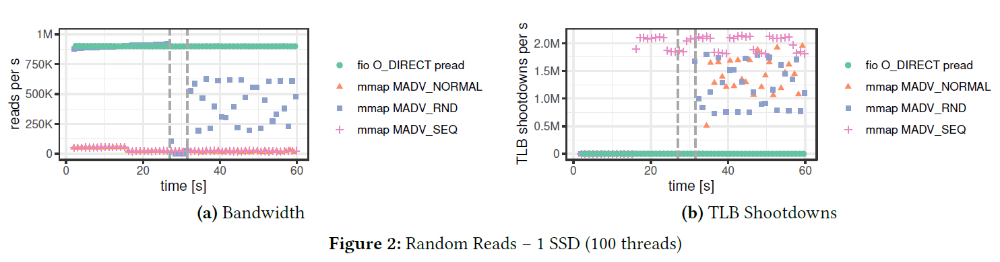
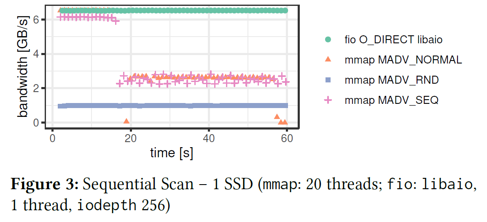
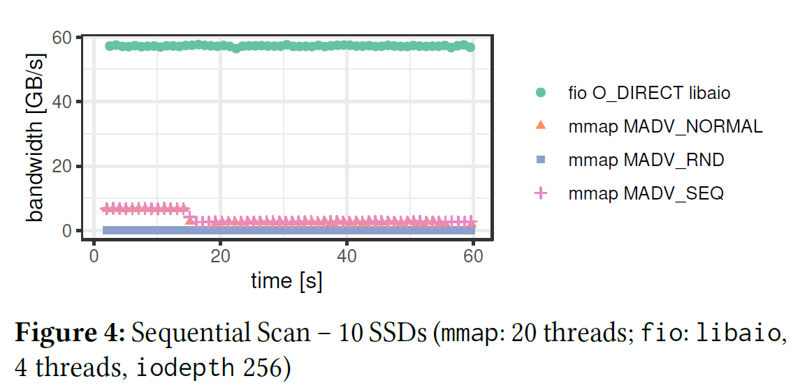

## 原文

[Are You Sure You Want to Use MMAP in Your Database Management System?](https://db.cs.cmu.edu/mmap-cidr2022/)

## 4 实验分析

正如上一节解释的那样，一些`mmap`的问题可以通过仔细地实现来克服，但是我们认为，如果不进行重大的操作系统级别的重写，其固有的性能限制就无法解决。在这一节，我们通过实验结果分析展示了这些问题。

我们所有的实验在一个单处理器插槽的机器上运行，其配置信息为：AMD EPYC 7713 CPU(64 cores, 128 hardware threads)，512GB RAM，其中100GB可用于Linux（v5.11）的页面缓存，对于持久性存储，该机器有10×3.8TB的 三星PM1733固态硬盘（额定读取速度为7000MB/s，写入速度为3800MB/s），我们将固态硬盘作为块设备来避免潜在的文件系统开销。

作为基准线，我们使用了存储基准工具`fio`[^1]，使用直接I/O(`O_DIRECT`)来绕过操作系统页面缓存。我们的分析专门聚焦在只读工作负载上，这代表了基于`mmap`的DBMS的最佳情况；否则，他们需要实现复杂的更新保护（3.1节），从而产生大量的额外开销。特别的是，我们评估了两种常见的访问模式：(1) 随机访问 和 (2) 顺序访问。

[^1]: [fio: Flexible I/O Tester.](https://github.com/axboe/fio)

### 4.1 随机读取

在第一个实验中，我们在一块2TB SSD 范围内使用随机访问模式来模拟大于内存的OLTP工作负载。由于页面缓存只有100GB的内存，95%的访问都导致了缺页中断（即工作负载是I/O绑定的）。

图2a展示了100个线程每秒随机读取的数量。我们的`fio`基准线表现出了稳定的性能，达到了接近每秒90万次的读取速度，这符合100次出色的I/O操作和大约100𝜇s的NVMe延迟的预期性能。换句话说，这个结果表明，`fio`可以使NVMe SSD的性能完全饱和。

另一方面，`mmap`表现较差，即使是使用提示来匹配工作负载访问模式。我们在实验中观察到`MADV_RANDOM`的三个不同阶段。`mmap`在开始的27秒内与`fio`表现接近，然后在接下来的5秒钟突然下降到接近0，最后恢复到`fio`性能的一半。这个突然的性能下降发生在页面缓存被填满的时候，迫使操作系统开始从内存把页面置换出去。不出意料地是，其他访问模式提示下有更糟的性能表现。

在3.4节，我们列举了页面置换开销的三个关键来源。第一个问题是 TLB shootdowns，我们使用`/usr/interrupts`记录的情况如图2b所示。如前所述，TLB shootdowns是十分昂贵的（需要成千上万个时钟周期），因为它涉及到发送处理器间的中断来刷新每个核心的TLB。第二，操作系统使用单个进程（`kswapd`）来置换页面，这在我们实验中是受CPU限制的。最后，操作系统必须同步页表，这在许多并发的线程中变得高度有竞争性。

### 4.2 顺序扫描

顺序扫描是DBMS的另一种常见的访问模式，特别是在OLAP工作负载中。因此，我们也在2TB SSD范围内对比了`fio`和`mmap`的扫描性能。我们首先使用仅仅一块SSD运行了我们的实验，然后我们在10块SSD组成的RAID 0上重新跑了相同的工作负载。

图3展示了`fio`可以利用一块SSD的全部带宽，同时保持稳定的性能。像之前的实验一样，`mmap`的性能开始和`fio`相似，但我们再次观察到，一旦页面缓存在大约17秒后被填满，性能就会急剧下降。另外，和这个工作负载预期的一样，`MADV_NORMAL`和`MADV_SEQUENTIAL`标志位比`MADV_RANDOM`性能要好。

图4展示了在10块SSD上重复顺序扫描的结果，进一步凸显了现代闪存理论上能够提供的与`mmap`能够实现的之间的差距。我们观察到在`fio`和`mmap`之间大概有20倍的性能差距，与使用一块SSD的结果相比，`mmap`几乎没有任何提升。

总的来说，我们发现`mmap`仅仅在单块SSD上的初始加载阶段表现得好。一旦页面置换开始或者使用多块SSD，`mmap`要比`fio`差2~20倍。随着PCIe 5.0 NVMe得即将发布，预计每块SSD的带宽将增加一倍，我们的结果展示了`mmap`不能够与传统的文件I/O的顺序扫描的性能相媲美。

## 6 结论

本论文提出了反对在DBMS中使用`mmap`来进行文件I/O。尽管有有限的好处，我们还是介绍了`mmap`的主要缺点，我们的实验分析证实了我们在其性能限制的发现。最后，我们向DBMS的开发者提供以下建议。

什么时候你**不**应该在你的DBMS中使用`mmap`：
- 你需要以一种事务安全的方式进行更新。
- 你想在不阻塞慢速I/O的情况下处理缺页中断，或者需要对内存中的数据进行明确控制。
- 你关心错误处理，需要返回正确的结果。
- 你需要在高速持久性存储设备上获得高吞吐量。

什么时候你**也许**应该使用`mmap`：
- 你的工作集（或者整个数据库）适合在内存中，并且工作负载是只读的。
- 你需要急于将产品推向市场，而不关心数据的一致性或者长期工程的头痛问题。
- 否则，永远不要使用。

