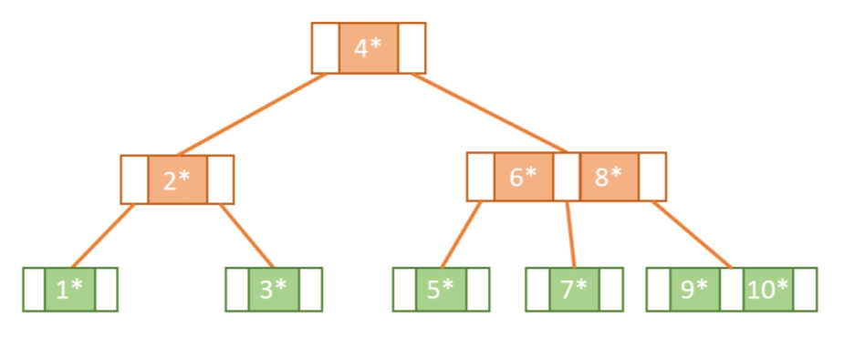
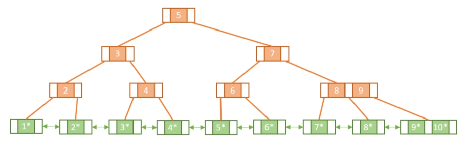
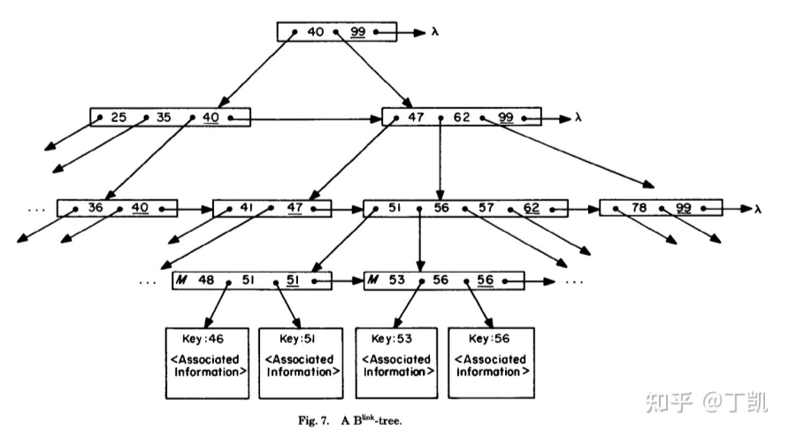
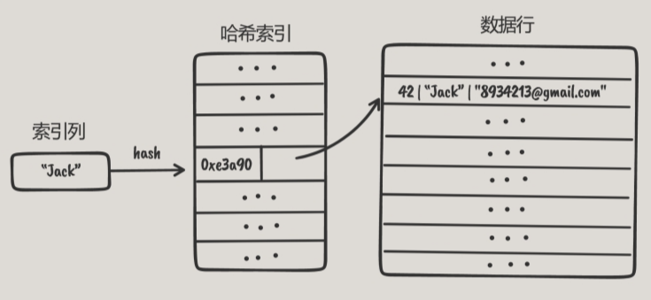
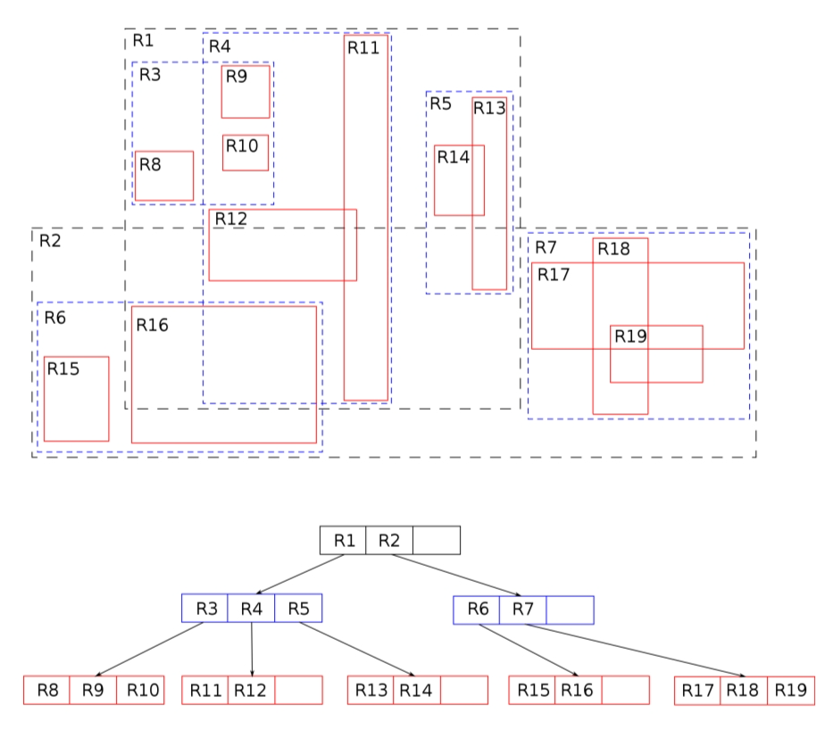
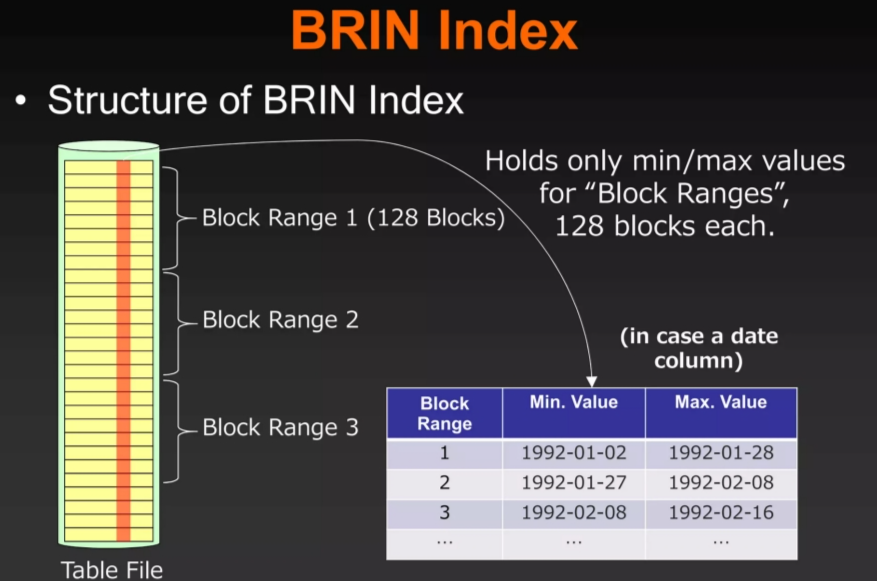
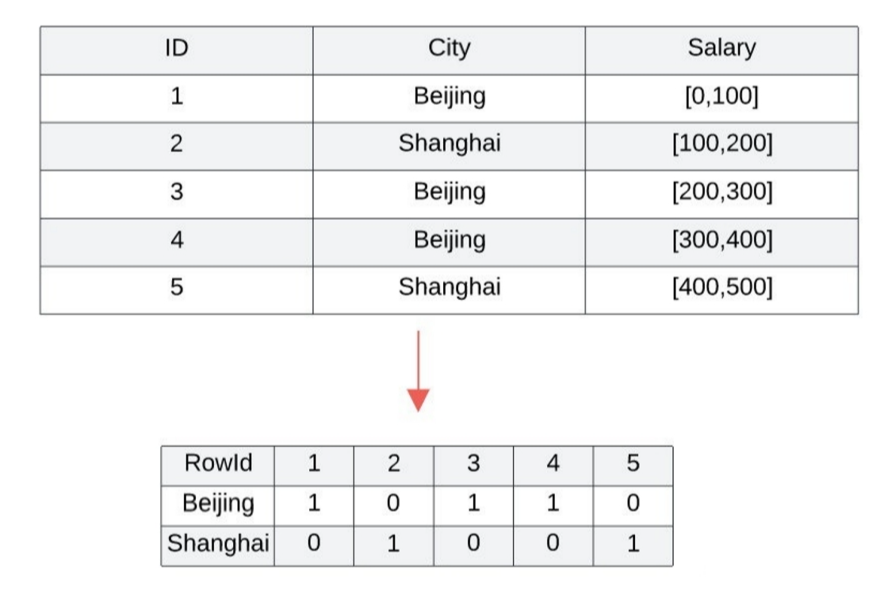

## B 树

B 树（B-tree）是一种自平衡的树，能够保持数据有序。这种数据结构能够让查找数据、顺序访问、插入数据及删除的动作，都在对数时间内完成。

在 B 树中，有两种结点:

1. 内部结点（internal node）：存储了数据以及指向其子结点的指针。
2. 叶子结点（leaf node）：与内部结点不同的是，叶子结点只存储数据，并没有子结点。

## B+ 树

B+ 树是 B 树的一个升级。

- 所有的非叶子结点可以看成是索引部分，不存储数据；
- 叶子结点存储数据，并且所有叶子结点形成链表。

### 相比 B 树的优点

- B+ 树中数据都存储在叶子结点上并链接在一起，这使得 B+ 树在查询范围内的数据时更加高效，因为它可以在一次遍历中查询出所有符合条件的数据。
- 全表扫描性能好，而B树需要完整遍历整棵树。

## B-link 树

B-link 树是在 B+ 树上的一种改进，该结构提升了读写并发度，能够保持高并发下的性能稳定。PostgreSQL 中使用的就是这中索引结构。

- 在中间结点增加字段 link pointer，指向右兄弟结点，B-link Tree 的名字也由此而来；
- 在每个结点内增加一个字段 high key，在查询时如果目标值超过该节点的 high key，就需要循
着 link pointer 继续往后继结点查找。

### 优势

树结构调整时无需对全局或者局部子树加锁，进而有利于高并发下的性能稳定性。

## 哈希索引（Hash Index）

哈希索引是基于哈希表实现的。对于每行数据，存储引擎都会对所有的索引列计算一个哈希值，哈希值不同键值的行计算出来不同，哈希索引将所有的哈希值存储在索引中，同时在哈希表中保存指向每个数据行的指针。

## 全文索引（Full-text Index）

全文索引是一种特殊的索引结构，它主要用于快速查询文本数据。全文索引使用的数据结构通常是倒排索引。倒排索引是一种线性结构，它记录了每个单词出现在文本中的位置。使用倒排索引可以快速查询出符合某些文本条件的数据。

## 空间索引（Spatial Index）

需要存储一些地理数据的位置或需要存储形状相关的数据时，可以使用空间索引。

### R-Tree

R树是用来做空间数据存储的树状数据结构。例如给地理位置，矩形和多边形这类多维数据创建索引。

### KD-Tree

kd-tree简称k维树，是一种空间划分的数据结构。常被用于高维空间中的搜索。

### 网格索引（Grid Index）

对地理空间进行网格划分，划分成大小相同的网格，每个网格对应着一块存储空间，索引项登记上落入该网格的空间对象。

## BRIN 索引

Block Range Index，简称BRIN索引。

BRIN索引是一组物理上相邻的块（页面），并保存每组的值的范围（最小值和最大值）。当在数据仓库系统执行聚合分析查询巨大表时，此方法非常有效。这样可以缩小搜索时的扫描范围。

## 位图索引（BitMap Index）

位图索引是一种使用位图的特殊数据库索引。

对于低 card 列，位图索引在查询时具有显著的空间和性能优势，但是对于插入和删除操作性能低。

## 主流数据库支持的索引类型

数据库 | B树/B+树/B-link树 | 哈希索引 | 全文索引 | 空间索引 | BRIN索引 | 位图索引
-- | -- | -- | -- | -- | -- | --
PostgreSQL | √ | √ | √ (Gin) | √ (Gist) | √ | 
MySQL | √ | √ | √ | √ |  |
SQL Server | √ | √ | √ | √ |  |
Oracle | √ | | | | | |
CockroachDB | √ | √ | √ (Gin) |  |  | 