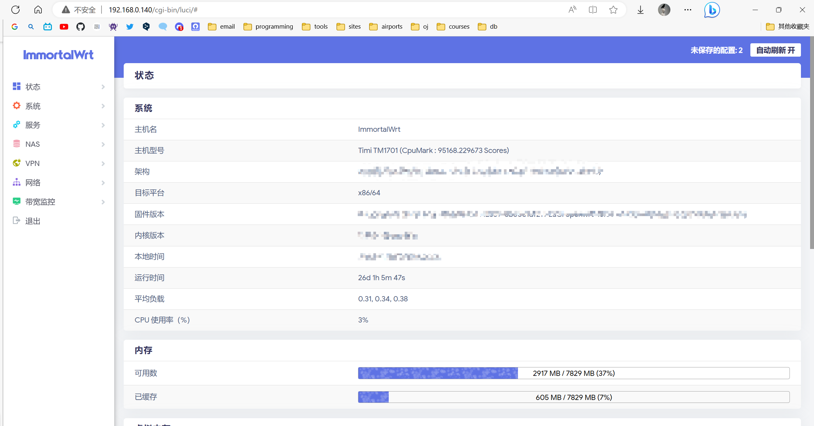

## 前期准备

### 拉取 Docker image

```bash
docker pull registry.cn-shanghai.aliyuncs.com/suling/openwrt:x86_64
```

>注：这里的镜像 tag 为架构，这里是 x86_64，可以根据自己的架构选择镜像。

### 开启网卡混杂模式

```bash
sudo ip link set eth0 promisc on
```

这里的`eth0`修改为自己的网卡名称。

### 创建 Docker 网络

```bash
docker network create -d macvlan --subnet=192.168.0.0/24 --gateway=192.168.0.1 -o parent=eth0 macnet
```

同样的，这里的`subnet`修改为自己的网段，`gateway`修改为当前网络内的网关。

## 部署镜像

### 创建网络配置文件

```bash
vim /path/to/openwrt/network
```

配置文件如下：

```
config interface 'loopback'
        option ifname 'lo'
        option proto 'static'
        option ipaddr '127.0.0.1'
        option netmask '255.0.0.0'

config globals 'globals'
        option packet_steering '1'

config interface 'lan'
        option type 'bridge'
        option ifname 'eth0'
        option proto 'static'
        option ipaddr '192.168.0.140'
        option netmask '255.255.255.0'
        option ip6assign '60'
        option gateway '192.168.0.1'
        option broadcast '192.168.0.255'
        option dns '192.168.0.140'

config interface 'vpn0'
        option ifname 'tun0'
        option proto 'none'
```

按照自己的情况修改 `config interface lan` 下的 `option ipaddr`、`option netmask`、`option gateway`、`option boardcast`和`option dns`。

### 启动容器

```bash
docker run --restart always --name openwrt-container -d --ip 192.168.0.x -v /path/to/openwrt/network:/etc/config/network --network macnet --privileged registry.cn-shanghai.aliyuncs.com/suling/openwrt:x86_64 /sbin/inut
```

`--ip`修改为上面网络配置文件中的`option ipaddr`。

## 登录管理界面

不出意外，你现在可以登录管理界面了。

这里的地址是 `http://192.168.0.140`，你可以通过浏览器访问，默认密码为 `password`。


## 连接设备到软路由

使用静态 IP，网关设置为 软路由的 IP，即可完成连接。

## References

<https://zhuanlan.zhihu.com/p/565520760>
