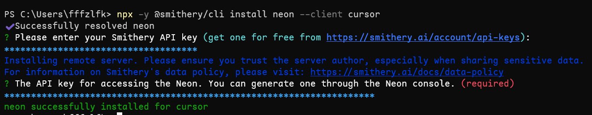
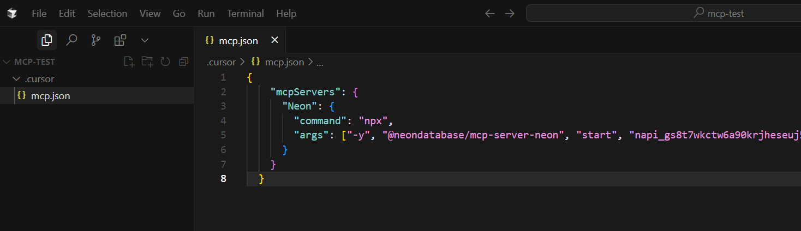
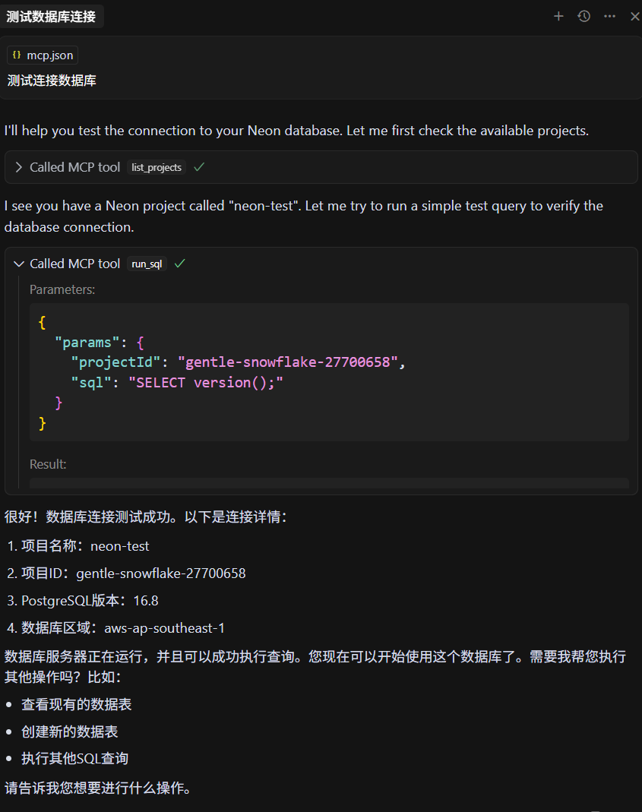
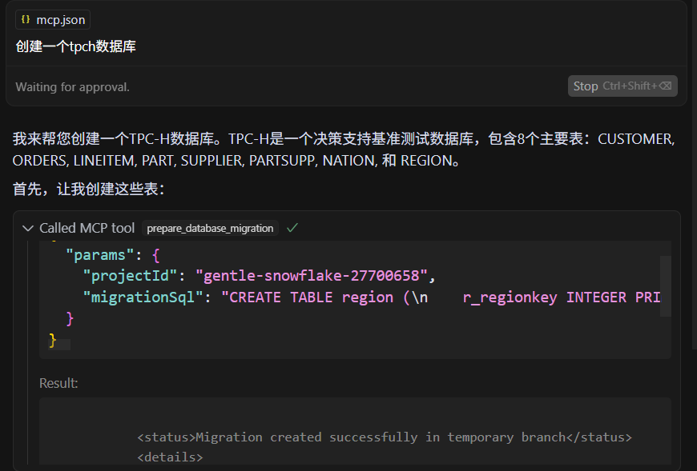

## Neon MCP 服务器

Neon MCP Server 是一个开源工具，它让你通过自然语言与 Neon Postgres 数据库进行交互。

不再需要使用 Neon 控制台或 API，只需输入类似“创建名为 'my-new-database' 的数据库”的请求即可。
如果你想查看你的项目，你可以问：“列出我所有的 Neon 项目”。Neon MCP Server 让这一切成为可能。

它的工作原理是作为自然语言请求和 Neon API 之间的桥梁。基于 Model Context Protocol（MCP） 构建，它可以将你的请求转换为必要的 Neon API 调用，使你能够管理从创建项目和分支到运行查询和执行数据库迁移的一切操作。

Neon MCP Server 在 MCP 架构中充当服务器角色，专为 Neon 设计。它提供了一组工具，MCP 客户端（如 Claude Desktop、Cursor）可以利用这些工具来管理 Neon 资源。这包括项目管理、分支管理、执行 SQL 查询以及处理数据库迁移等操作，所有这些都是通过自然语言请求驱动的。

### MCP 和 Neon MCP Server

Model Context Protocol (MCP) 标准化了大语言模型（LLMs）与外部工具之间的通信。它定义了一个客户端-服务器架构，使 LLMs（称为 Hosts）可以连接到提供上下文和工具的专业服务器，从而与外部系统进行交互。MCP 架构的关键组件包括：

- Host（主机） ：这些是 AI 应用程序，例如 Claude Desktop 或 Cursor 这类 IDE，它们会主动连接到 MCP 服务器。
- Client（客户端） ：这些客户端位于 Host 应用中，并与各个 MCP 服务器保持一对一连接。
- Server（服务器） ：这类程序，如 Neon MCP Server，为客户端提供上下文、工具和提示信息，使其可以访问外部数据和功能。

### 为什么要使用 MCP？

传统上，将 AI 模型连接到不同数据源需要开发者为每个集成编写定制代码。这种碎片化的方法增加了开发时间、维护负担，并限制了 AI 模型与工具之间的互操作性。MCP 通过提供一种标准化协议解决了这个问题，简化了集成过程，加速了开发速度，并增强了 AI 助手的功能。

### 使用 Neon MCP Server 的主要优势：

1. 自然语言交互 ：通过直观、对话式的命令管理 Neon 数据库。
1. 简化的数据库管理 ：无需编写 SQL 或直接使用 Neon API 即可执行复杂操作。
1. 提升工作效率 ：优化数据库管理和开发流程。
1. 对非开发者友好 ：让具备不同技术背景的用户都能轻松地与 Neon 数据库互动。
1. 支持数据库迁移 ：利用 Neon 的分支功能，在自然语言驱动下进行数据库模式变更。

## 本地安装 MCP Server

### 前置条件

1. Node.js（>= v18.0.0）
2. Neon API KEY：你需要一个 Neon API 密钥，以便让 Neon MCP Server 代表你的 Neon 账户进行身份验证。你可以在 Neon 控制台的个人资料设置中[创建一个 API 密钥](https://neon.tech/docs/manage/api-keys#creating-api-keys)。

### 通过 Smithery 安装 MCP 服务器

打开终端，运行下面的命令：

```bash
npx -y @smithery/cli install neon --client <client_name>
```

`client_name`可以是`claude`、`cursor`、`windsurf`、`roo-code`、`witsy`、`vscode`等等。

这里我们选择使用`cursor`，在安装过程中会提示输入两个 API_KEY，首先输入 smithery 的API_KEY（[创建smithery API_KEY](https://smithery.ai/account/api-keys)），接着输入前面准备好的Neon API KEY。



## 将 MCP 客户端（Cursor）连接到 Neon

1. 打开 Cursor，在打开的根目录创建一个 `.cursor` 文件夹。
1. 在 .cursor 文件夹中，创建 mcp.json 文件，内容如下所示：
1. 将其中的 `<YOUR_NEON_API_KEY>` 替换为前面准备好的Neon API_KEY。

```json
{
  "mcpServers": {
    "Neon": {
      "command": "npx",
      "args": ["-y", "@neondatabase/mcp-server-neon", "start", "<YOUR_NEON_API_KEY>"]
    }
  }
}
```



## 使用自然语言与Neon数据库进行交互

现在我们就可以在cursor中和Neon数据库进行交互了。

我们首先测试一下连接：我们输入“测试连接数据库”，然后回车，可以看到向 Neon 数据库发送了SELECT version();命令来测试数据库连接，并返回了结果。



### 其他交互

我们也可以使用自然语言创建schema，比如可以创建TPCH表...



## References

- <https://neon.tech/docs/ai/neon-mcp-server>
- <https://www.bilibili.com/video/BV1XEodY4Epc/?spm_id_from=333.337.search-card.all.click&vd_source=490cf2f6564af643746c73ed085d81ea>